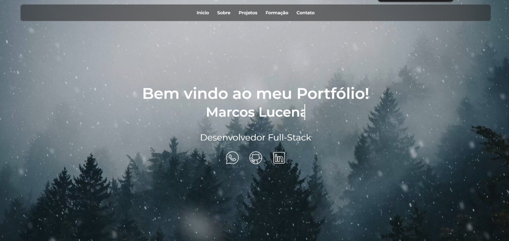

# 🚀 Portfólio - Marcos Lucena

Este é o meu portfólio pessoal desenvolvido com Angular, onde apresento informações sobre mim, minhas formações, projetos e formas de contato. O objetivo é compartilhar minha trajetória, habilidades e trabalhos desenvolvidos como desenvolvedor Full-Stack.

## 📌 Funcionalidades

- 📖 Seção Inicio – Apresentação com um video interativo de neve e minhas redes sociais

- 📖 Seção Sobre Mim – Apresentação pessoal, tecnologias que domino e download do curriculo

- 💻 Seção Projetos – Meus principais projetos com descrição e links

- 🎓 Seção Formação – Certificados em formato de carrossel responsivo

- 📩 Contato – Sessão para entrarem em contato pelas mídias sociais

## 🛠️ Tecnologias Utilizadas

- Frontend: Angular 18, TypeScript, HTML5, CSS3

- Bibliotecas:
  - FontAwesome (ícones)
  - Responsividade com CSS Flexbox e Grid

- Ferramentas de Desenvolvimento:
  - Node.js
  - NPM
  - Git & GitHub

## ⚡ Como Rodar o Projeto

### Pré-requisitos
  - Node.js (>= 18.x)
  - Angular CLI (>= 18.x)

## Passos

Clone o repositório

- git clone https://github.com/MarcosLucena0/Portfolio.git

Acesse a pasta do projeto

- cd Portfolio

Instale as dependências

- npm install

Rode o projeto localmente

- ng serve -o

O projeto estará disponível em http://localhost:4200/.

## 📸 Demonstração

## 📬 Contato

Se quiser trocar uma ideia ou conhecer mais sobre meu trabalho:

- 📧 Email: marcoslucenadesouza@gmail.com

- 💼 LinkedIn: [linkedin.com/in/MarcosLucena](https://www.linkedin.com/in/marcos-lucena-91576a245/)

- 🐙 GitHub: [github.com/MarcosLucena](https://github.com/MarcosLucena0)

## 📄 Licença

Este projeto está sob a licença MIT.
